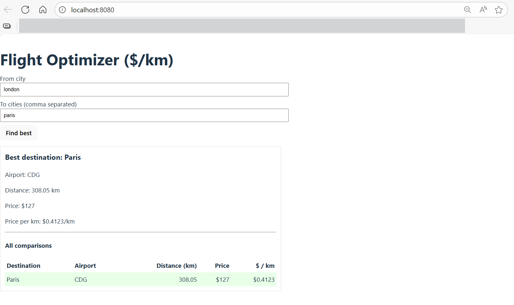

# IMAGE

# Flight Optimizer ($/km)

Find the **best destination (lowest USD per kilometer)** among several candidate cities using the Kiwi (Tequila) public APIs.  
This project includes:

- A **CLI tool** (`./flight-optimizer`) for Part 1
- A **Django + DRF (Django REST Framework) backend** exposing `POST /api/best`
- A **React (Vite)** frontend for Part 2
- A **Docker Compose** setup to run everything with **one command**

---

## 1️⃣ Assignment Requirements

**Goal:** Choose a destination from a list of candidate cities and find the **most affordable flight in USD per kilometer** between the origin and each destination.

### Must:

- Use Kiwi’s **Tequila API** at `https://tequila-api.kiwi.com/`
- Authenticate with your Tequila **API key** via the `apikey` header
- Assume:
  - One adult traveler
  - Flights departing **within 24 hours**
  - Use **main airport** for each city
  - You may compute distance via Kiwi’s data or your own Haversine implementation

### Deliverables

#### CLI

- Command:
  ```bash
  ./flight-optimizer --from <city> --to <city> [<city> ...]
  ```
- Output: **best destination** and **USD per km**

#### Web UI

- A **React frontend** with a single form: origin + destinations (comma separated)
- A **single Django endpoint**: `POST /api/best`
- Display the best result on screen

## 2️⃣ Stack Overview

| Layer            | Technology                       |
| ---------------- | -------------------------------- |
| Backend          | Django 5 + Django REST Framework |
| Frontend         | React (Vite, TypeScript)         |
| API              | Kiwi Tequila API                 |
| Containerization | Docker + Docker Compose          |
| Proxy            | Nginx (in Docker mode)           |

---

## 3️⃣ Project Structure

```
flight-optimizer/
│
├── backend-api/
│   ├── core/                 # Django core project
│   ├── flights/              # App logic
│   ├── .env                  # (not committed)
│   ├── Dockerfile
│   ├── manage.py
│   └── requirements.txt
│
├── frontend-ui/
│   ├── src/
│   ├── Dockerfile
│   └── nginx.conf
│
└── docker-compose.yml
```

---

## 4️⃣ Requirements & Installation

### Local

- Python **3.13+**
- Node.js **>=18**
- npm
- curl (for testing)

### Docker

- **Docker Desktop** (Windows/Mac) or **Docker Engine + Compose v2** (Linux)

---

## 5️⃣ Environment Variables

Create `backend-api/.env`:

```
TEQUILA_API_KEY=YOUR_API_KEY_HERE
TEQUILA_BASE_URL=https://tequila-api.kiwi.com
```

---

## 6️⃣ Running Locally (no Docker)

### 6.1 Backend (API + CLI)

```bash
cd backend-api
python -m venv .venv
source .venv/Scripts/activate  # Windows
# or: source .venv/bin/activate  # macOS/Linux

pip install -r requirements.txt
python manage.py migrate
python manage.py runserver 8000
```

✅ The backend is now running at `http://127.0.0.1:8000`.

Test API:

```bash
curl -X POST http://127.0.0.1:8000/api/best   -H "Content-Type: application/json"   -d '{"from":"London","to":["Paris","Rome","Madrid"]}'
```

Expected output:

```json
{
  "destination": "Madrid",
  "airport": "MAD",
  "price": 174.0,
  "distance_km": 1214.28,
  "price_per_km": 0.1433
}
```

Run CLI directly:

```bash
./flight-optimizer --from "London" --to "Paris" "Rome" "Madrid"
# Output:
# Madrid
# $0.1433/km
```

---

### 6.2 Frontend (React)

```bash
cd ../frontend-ui
npm install
npm run dev
```

Open [http://127.0.0.1:5173](http://127.0.0.1:5173)  
and make sure your backend (port 8000) is running.

---

## 7️⃣ Running with Docker (Recommended)

Build and run both services:

```bash
docker compose up --build
```

- Frontend + proxy: [http://localhost:8080](http://localhost:8080)
- Backend (direct): [http://localhost:8000](http://localhost:8000)

### Test via browser:

1. Go to [http://localhost:8080](http://localhost:8080)
2. Enter:
   - **From:** `London`
   - **To:** `Paris, Rome, Madrid`
3. Press “Find best”  
   You’ll get a live result or message: “No results in the next 24 hours.”

### Test API directly (through proxy):

```bash
curl -X POST http://localhost:8080/api/best   -H "Content-Type: application/json"   -d '{"from":"London","to":["Paris","Rome","Madrid"]}'
```

### Stop all containers:

```bash
docker compose down
```

---

## 8️⃣ Testing

### Unit Test Example

```bash
cd backend-api
source .venv/Scripts/activate
pip install pytest pytest-django
pytest
```

### Smoke Test in Docker

After `docker compose up --build`:

```bash
curl -X POST http://localhost:8080/api/best   -H "Content-Type: application/json"   -d '{"from":"London","to":["Paris","Rome","Madrid"]}'
```

---

## 9️⃣ Troubleshooting

| Issue                   | Possible Fix                                                                  |
| ----------------------- | ----------------------------------------------------------------------------- |
| “Location not found”    | Try using specific **city** names (e.g., “San Juan” instead of “Puerto Rico”) |
| “Internal server error” | Check your `TEQUILA_API_KEY` in `.env`                                        |
| CORS errors (local)     | Backend already has `CORS_ALLOW_ALL_ORIGINS=True`                             |
| Docker build fails      | Ensure `.env` exists in `backend-api/` before running compose                 |

---
